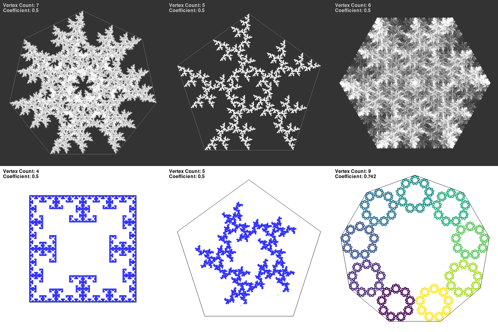

# MCMC Ising model

Here are the files created during the TV@J within the MCMC miniproject. The results and the math behind the contents of this repository are [here (CZE)](https://tydenvedy.fjfi.cvut.cz/fyztyd/fyztyd/uploadsb/files/montemarkov_xx_180624_2316.pdf).

## The idea behind the project

This project deals with the problem of sampling from a predetermined Boltzmann distribution (Ising model) and analyzing it to answer the given questions using Monte Carlo and Markov chains (MCMC for short). 

## The problems to solve

1. Plot the dependence of the average energy on temperature.
2. Let _C_ be the number of connected black regions. Plot the
dependence of the expected value of _C_ and the temperature.
3. Let _L_ be the probability of percolations (forming of clusters
and their subsequent possibility of forming a chain connecting
the top and bottom, see the image lower). Plot this value with respect
to temperature. 

 
## The methods used

Due to the numerical nature of this problem we used Python to do all the operations and simulations. We than displayed the obtained data using matplotlib.

We processed the results by forgetting the first 10% of 10 million iterations. Individualaverages are indicated by points in the graphs, the shaded areas indicate the standarddeviation at each point.

## The results

__The results are described in higher detail in the official paper linked in the beginning of this README.__

In solving the first problem we obtained, using a the code in [this file](/poster/python-main/energie_na_teplote.py), the relation in the image lower which shows a rapid increase in energy at the boundary of low and higher temperatures and then a much slower growth in the high and low temperatures respectively. We can see that the growth is very similar to the previous curve so they must be related. Lastly, in the third problem we got a much less clear result. However, we can still make out a apparent decrease in percolation probability with temperature. All of these results and their corresponding graphs are included and described in the paper linked above.

An interesting observation we made was that the energy of a grid with randomly generated 1s and 0s is n^2, where n is the size of the square grid (n by n, in our case n=256). Not only is this interesting by itself, but as the temperature grows, the grid approaches this random gray noise. This suggests that the energy of a grid at high temperature T should be n^2, which aligns with the graph presented in our paper. This observation can also be supported analytically.

# The Chaos Game

While preparing fo the FIHS conference I came along a very visually interesting thing called the _chaos game_. It creates beatiful patterns from randomness. It can be described as a  discrete time Markov chain with continuous state spac (ℝ²). The simplest example is the Sierpinski triangle.

You can read about he basics on the [chaos game Wikipedia page](https://en.wikipedia.org/wiki/Chaos_game), but basically the three parameters impacting the final result are:

1. __The polygon vertex count (N):__ This is pretty straightforward, the shape from which the game is "bouncing". I've only worked with regular polygons.
2. __The coefficient of LERP (r):__ How far from the last generated point to the chosen polygon vertex is the next point going to be generated. I've mostly used r=0.5.
3. __The choice rule:__ This one is the most interesting and also mystical of sorts. It defines which vertexes can be chosen each round. The rule can be anything, so here are a few examples:
    + Any vertex except the last one chosen
    + The direct neighbours of the last chosen vertex
    + Any vertex from the half of vertexes following the last chosen vertex 
    + Any vertex except the one before the last chosen vertex

## My execution
I've generated the images using my [Python script](chaos-game/chaos-game-ext.py) and sagved them in the [gen-imgs folder](chaos-game/gen-imgs). I've also created the Chaos game explorer to help go throught everything. It has its own [documentation](chaos-game/ch-g-explorer/usage.md) in case of any confusion. Here are some of the images generated:

