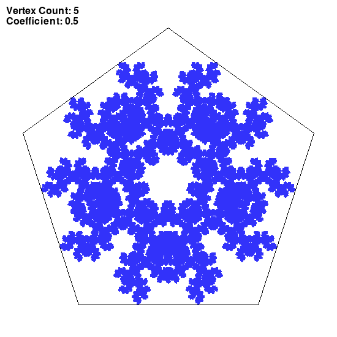
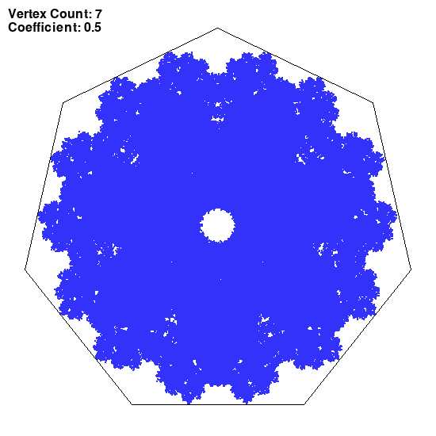

## Chaos game
### Session parameters

coefficient of LERP: c=0.5

__Rule for choosing the next vertex:__
Any vertex except the previous one ```(n+randint(1, vertexCount))```
### Images generated





