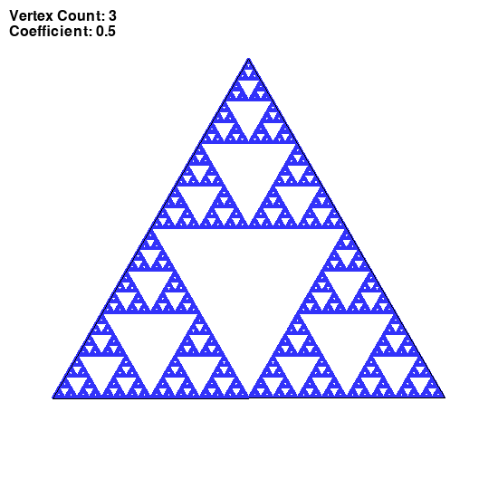
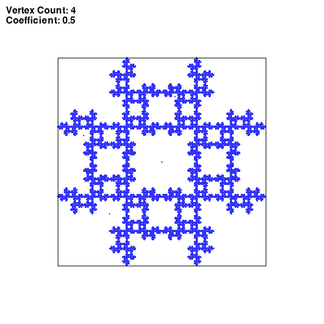
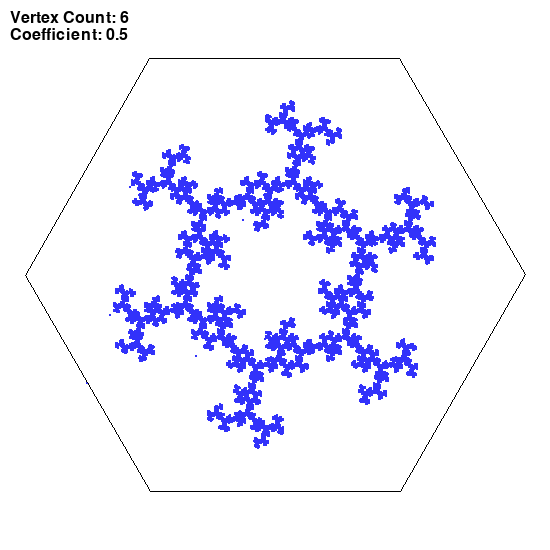
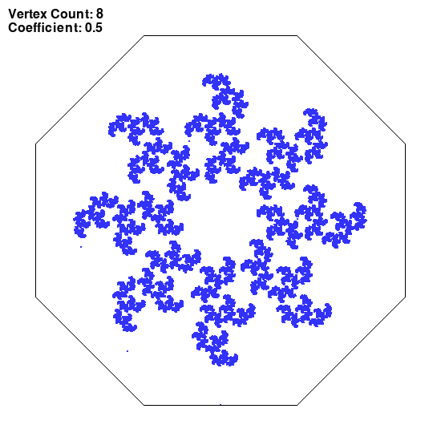
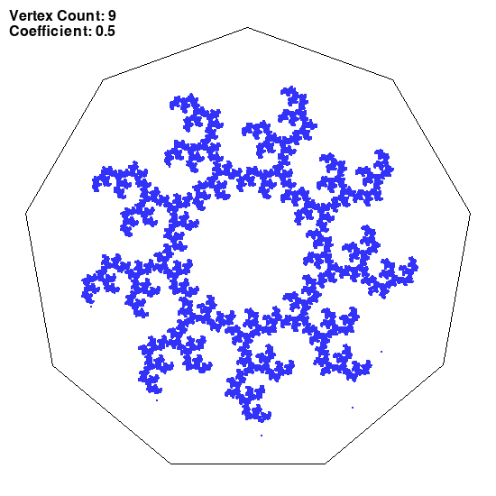
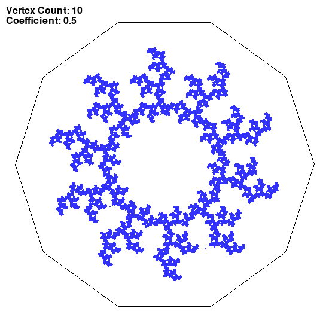

## Chaos game
### Session parameters

coefficient of LERP: c=0.5

__Rule for choosing the next vertex:__
The last chosen vertex plus random number between 1 and 3 ```(n+randint(1, 3))```
### Images generated












