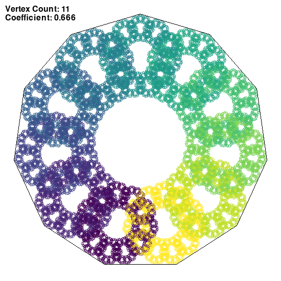
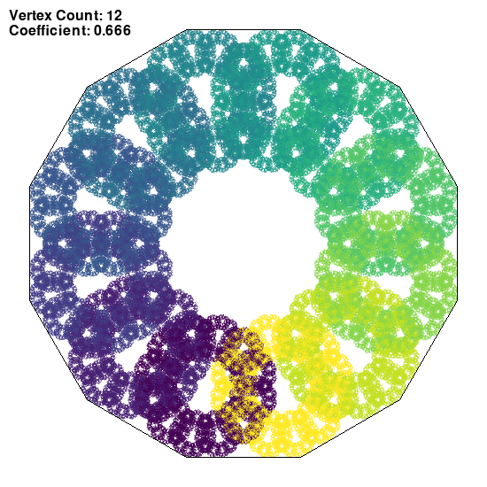

## Chaos game
### Session parameters

Coefficient of LERP: r=0.666...
Single point opacity: 80/255

*Rule for choosing the next vertex:*
Any vertex
```
(randint(vertexCount))
```
### Images generated



