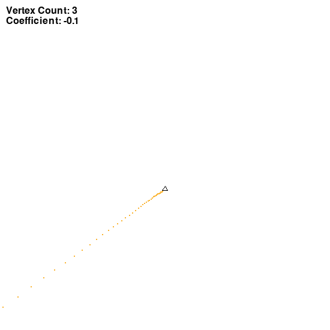

## Chaos game
### Session parameters

Coefficient of LERP: r=-0.1
Single point opacity: 255/255

*Rule for choosing the next vertex:*
The last chosen vertex NEZADANO _(n+NEZADANO)_
### Images generated

