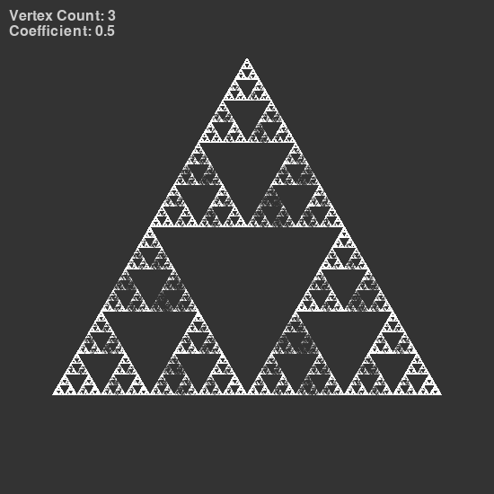
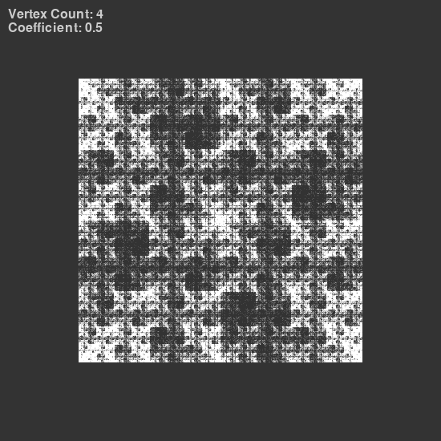
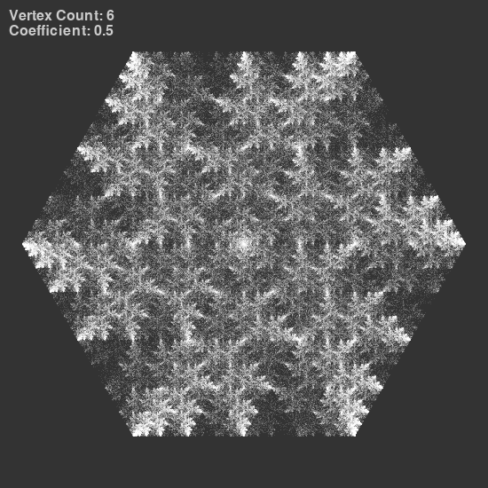
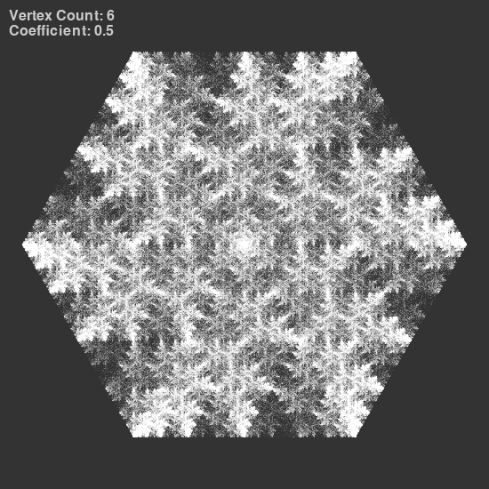
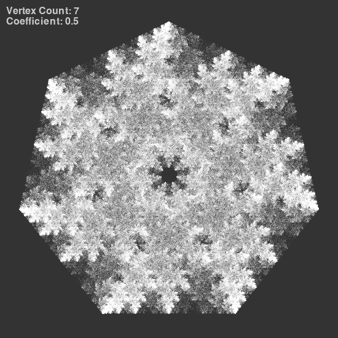
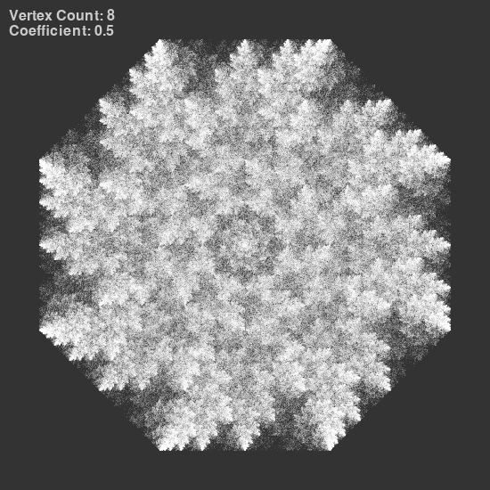
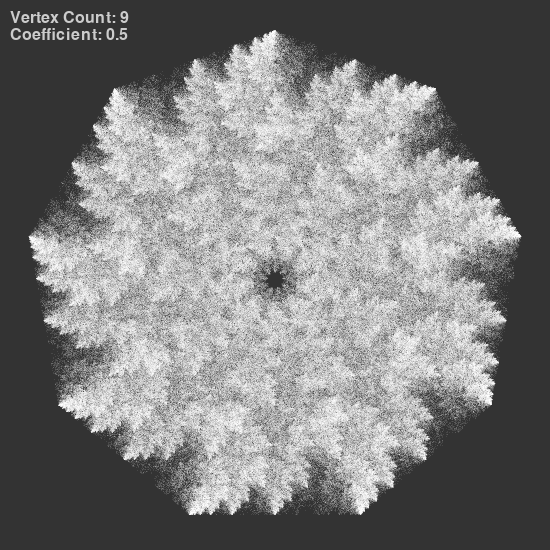
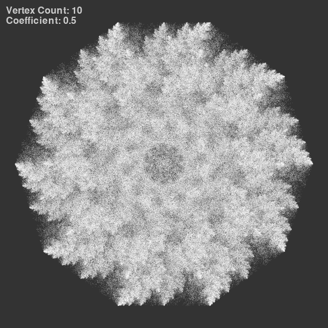

## Chaos game
### Session parameters

Coefficient of LERP: r=0.5
Single point opacity: 25/255

*Rule for choosing the next vertex:*
The last chosen vertex NEZADANO ```(n+NEZADANO)```
### Images generated
















