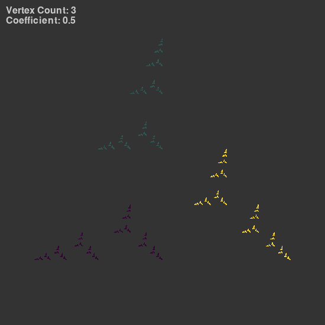
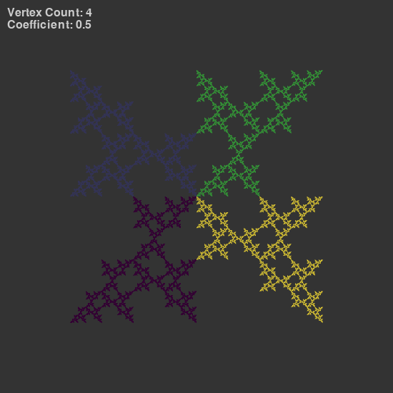

## Chaos game
### Session parameters

Coefficient of LERP: r=0.5
Single point opacity: 2/255

*Rule for choosing the next vertex:*
Randomly chosen vertex from the following half of vertexes after the last chosen vertex and ```(n+randint(floor(vertexCount/2)))```
### Images generated



