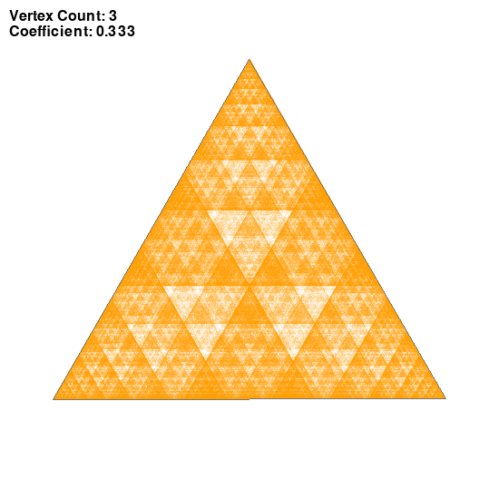
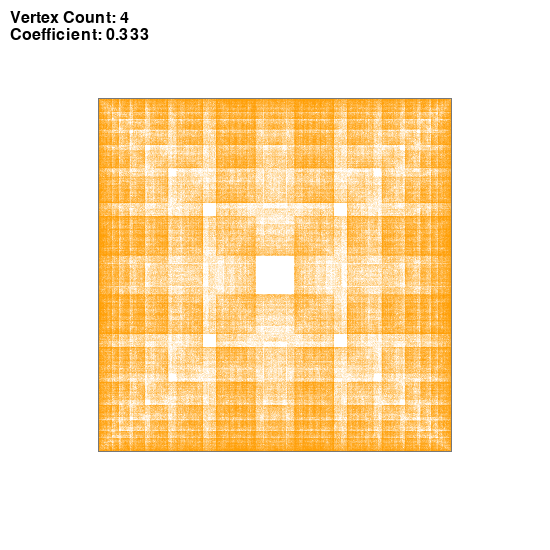
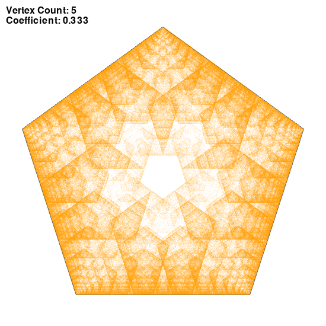
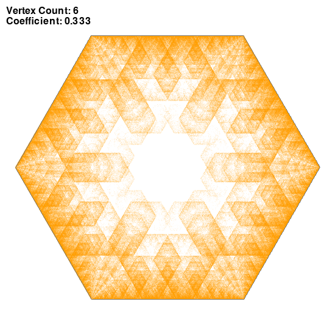
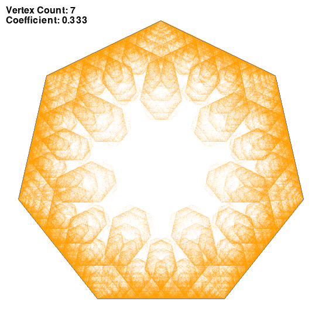
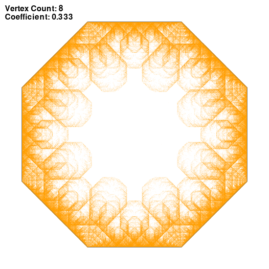
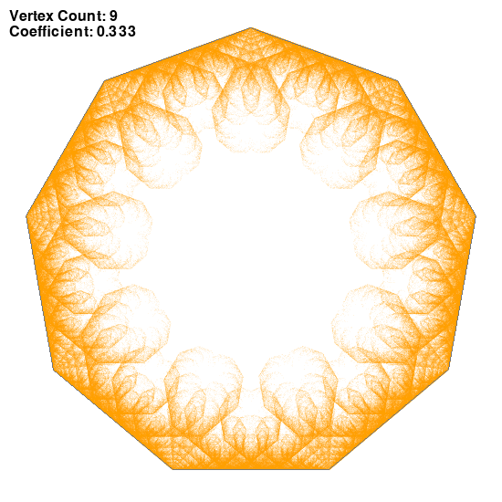
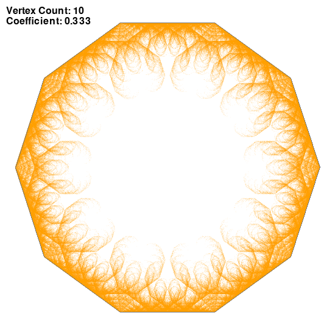

## Chaos game
### Session parameters

Coefficient of LERP: r=1/3
Single point opacity: 15/255

*Rule for choosing the next vertex:*
The last chosen vertex or its direct neighbours ```(n + randint(-1, 1))```
### Images generated















