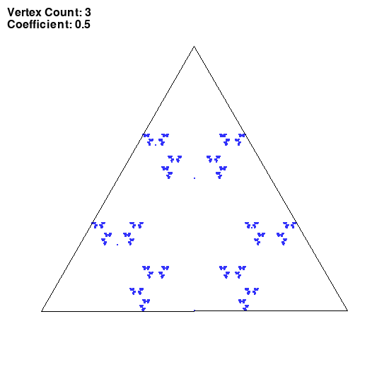
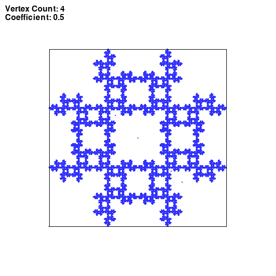
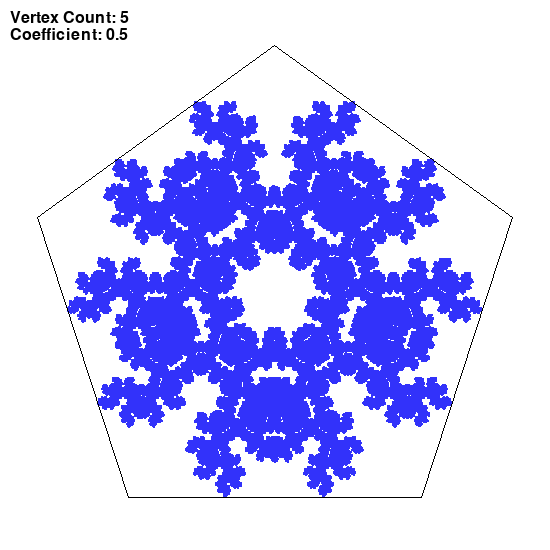
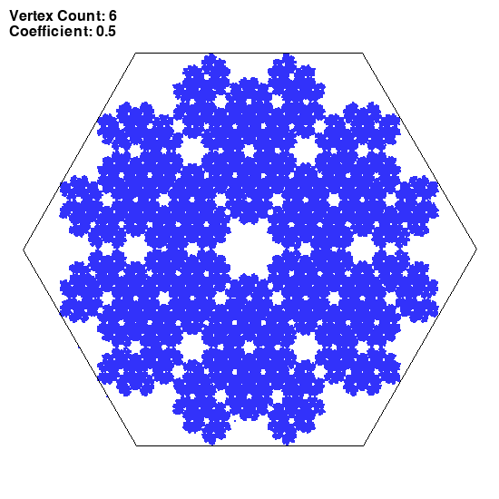
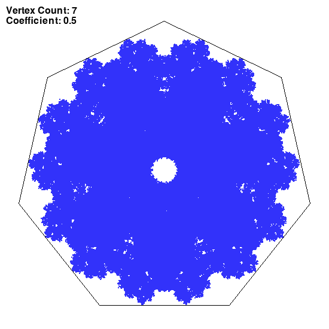

## Chaos game
### Session parameters

coefficient of LERP: c=0.5

*Rule for choosing the next vertex:*
The last chosen vertex any vertex except the previous one _(n+randint(1, vertexCount))_
The vertex loops around (%)
### Images generated

