## Chaos game
### Session parameters

Coefficient of LERP: c=0.5
Single point opacity: 35/255

*Rule for choosing the next vertex:*
The last chosen vertex and its 4 neigbours _(n+randint(-2, 2))_
### Images generated

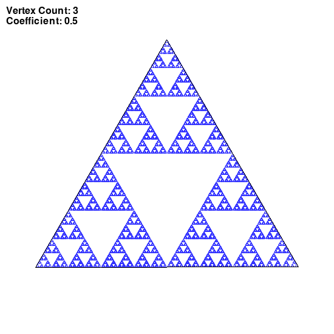

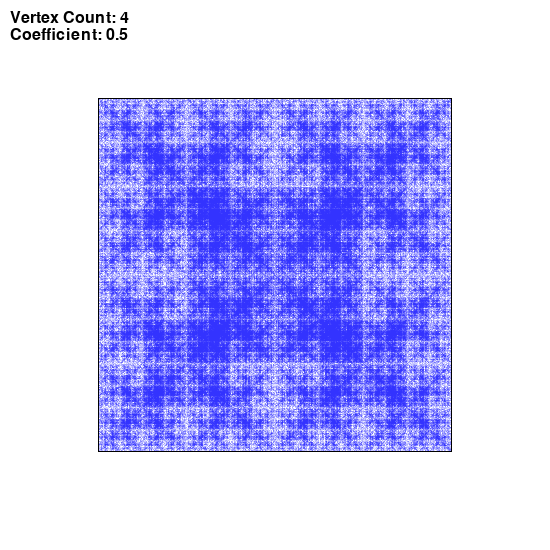

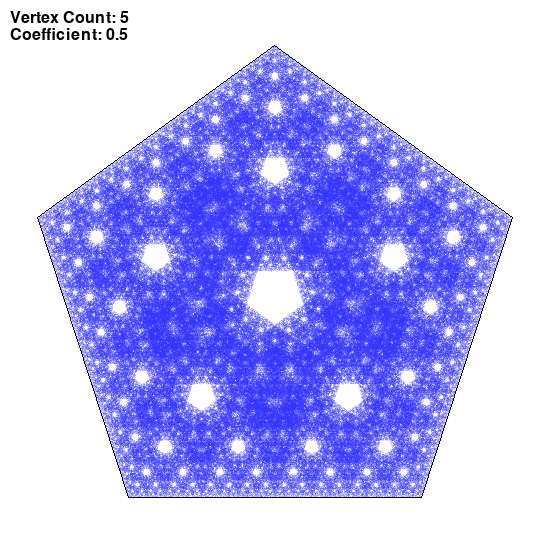

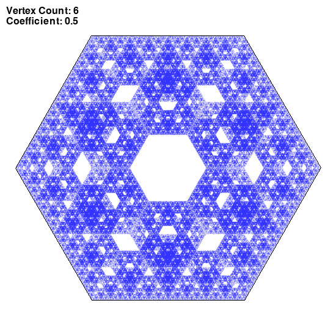

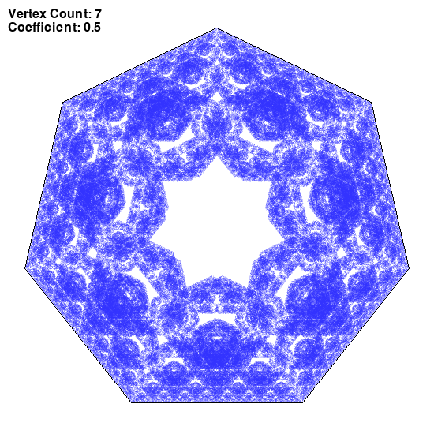

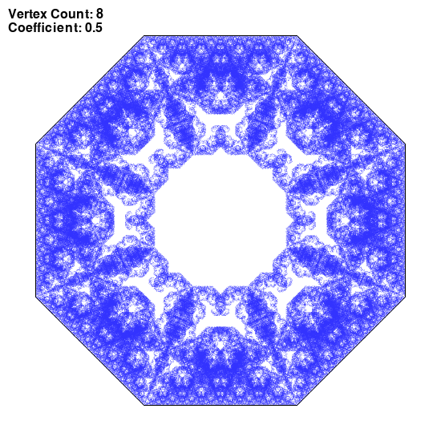

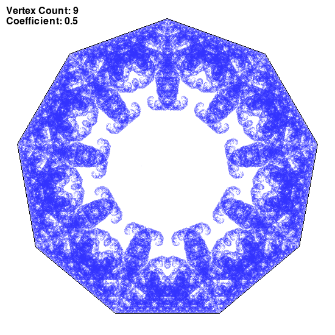

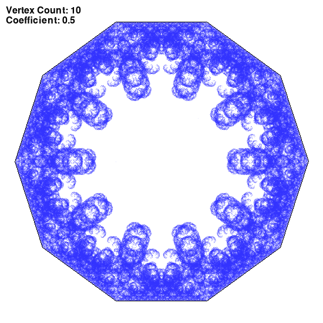

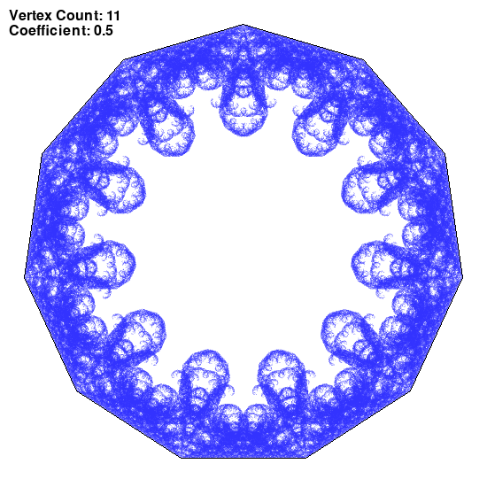

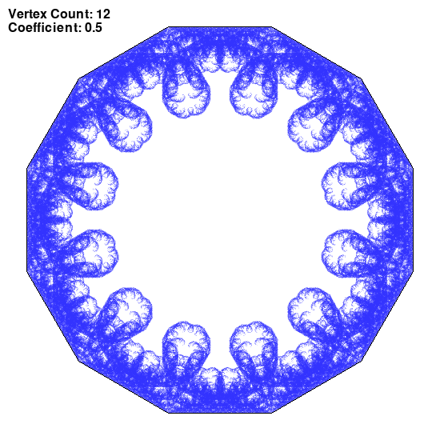

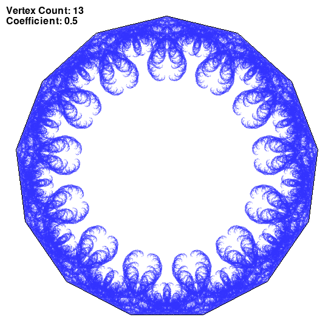

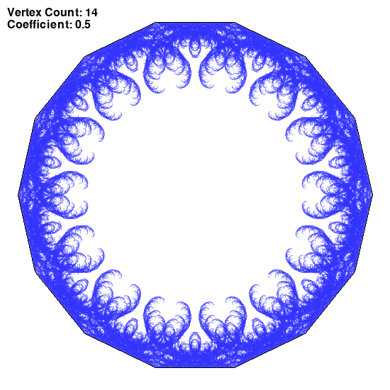

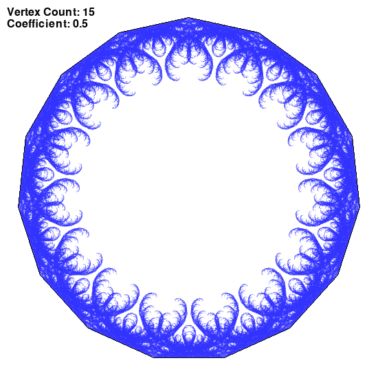