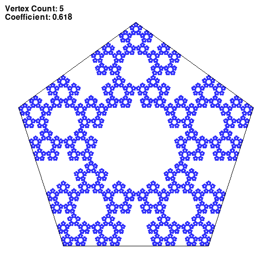
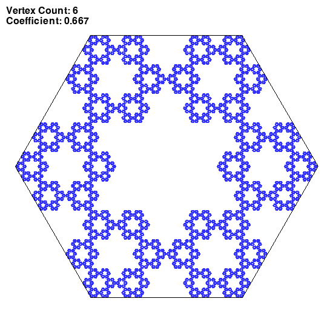
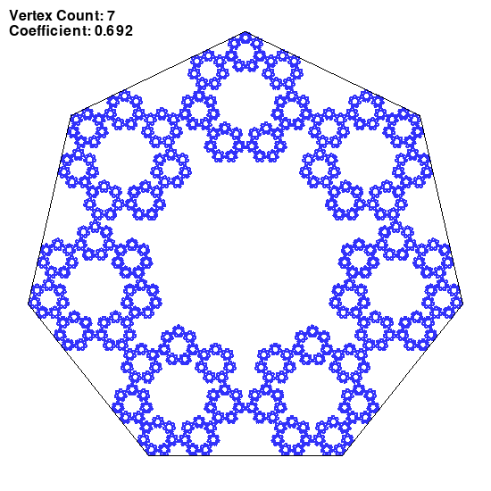
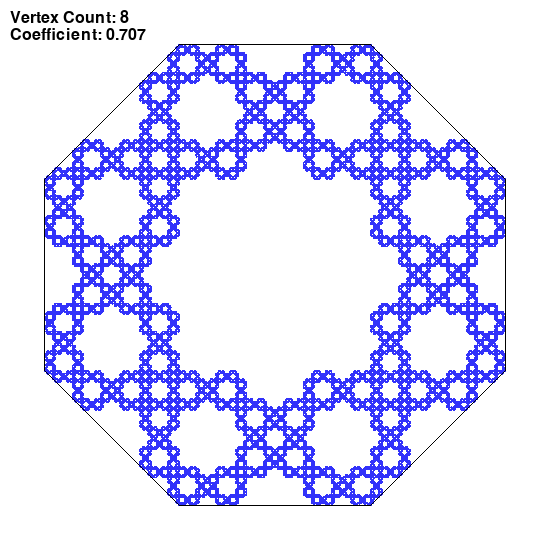
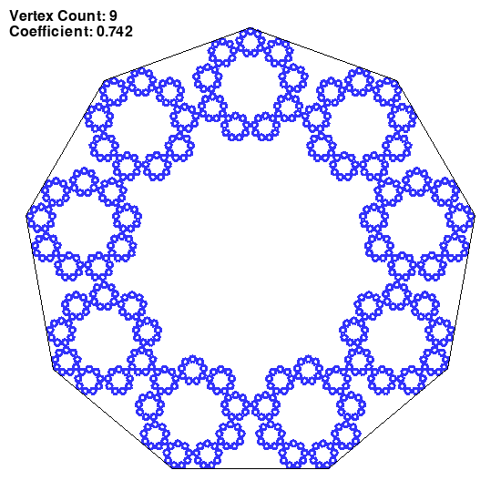
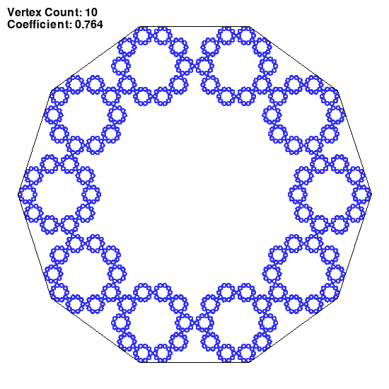
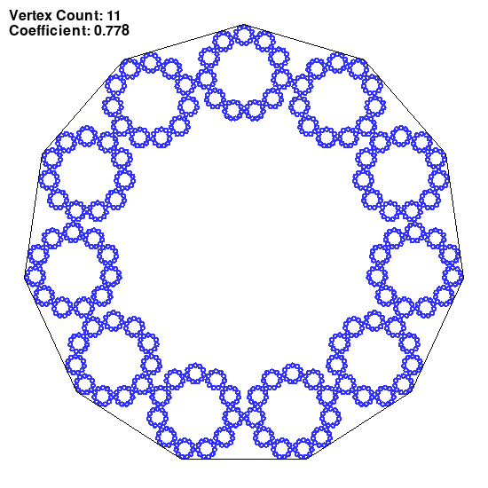
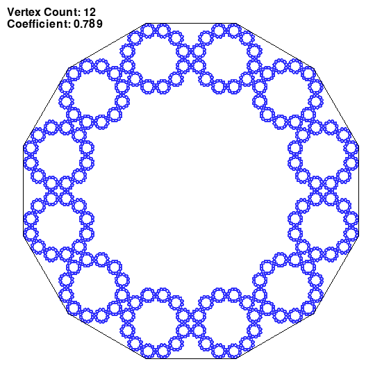
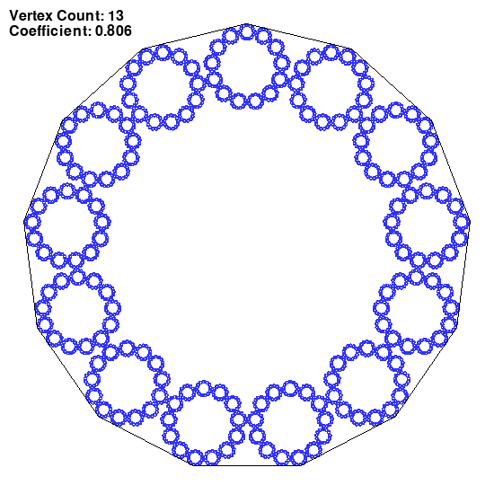

## Chaos game
### Session parameters

Coefficient of LERP: the optimal r according to https://doi.org/10.1016/j.chaos.2021.111140 page 150
Single point opacity: 255/255

*Rule for choosing the next vertex:*
Any vertex _(randint(0, vertexCount))_
### Images generated

