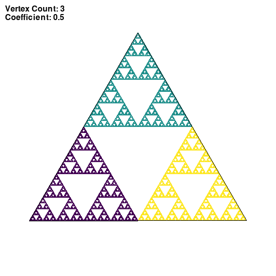
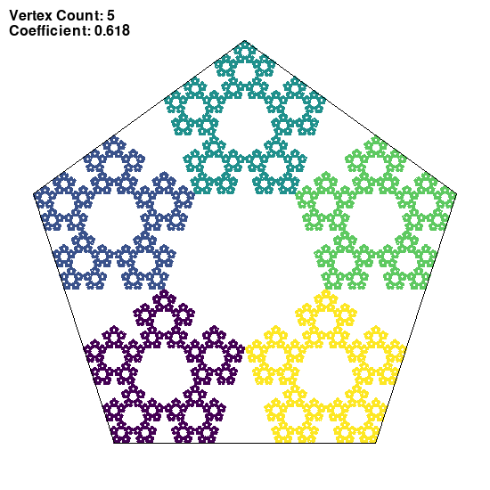
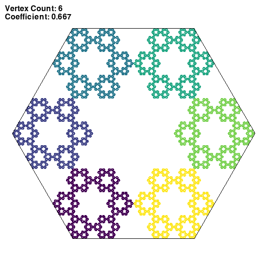
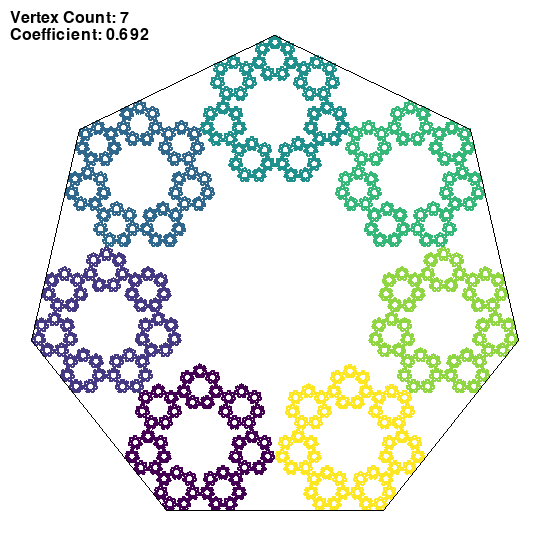
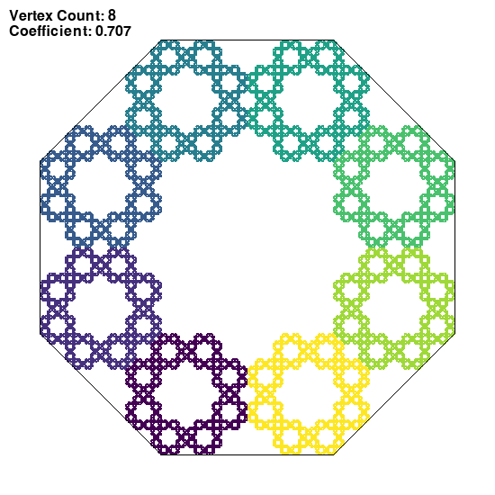
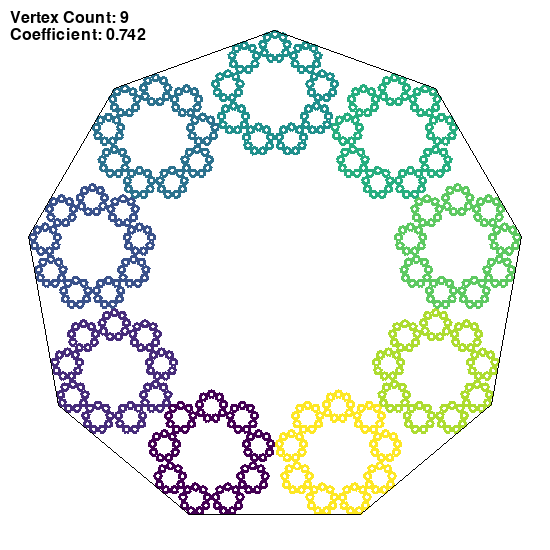

## Chaos game
### Session parameters

Coefficient of LERP: the optimal r according to https://doi.org/10.1016/j.chaos.2021.111140 page 150
Single point opacity: 255/255

__Rule for choosing the next vertex:__
Any vertex ```(randint(0, vertexCount))```
Colored by the chosen  vertex
### Images generated














