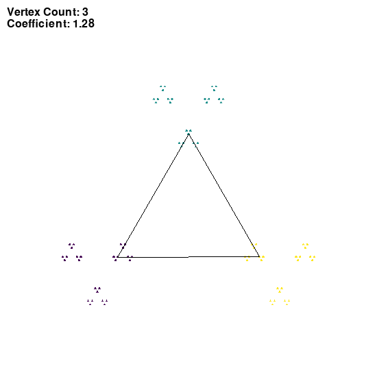
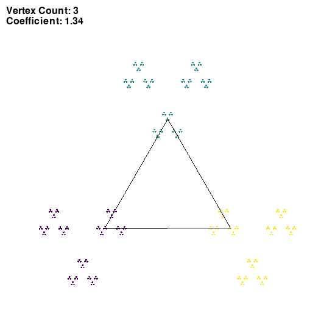
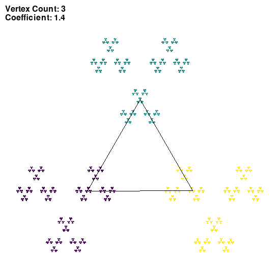
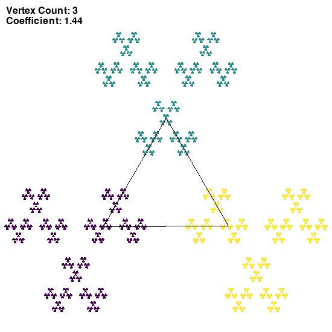
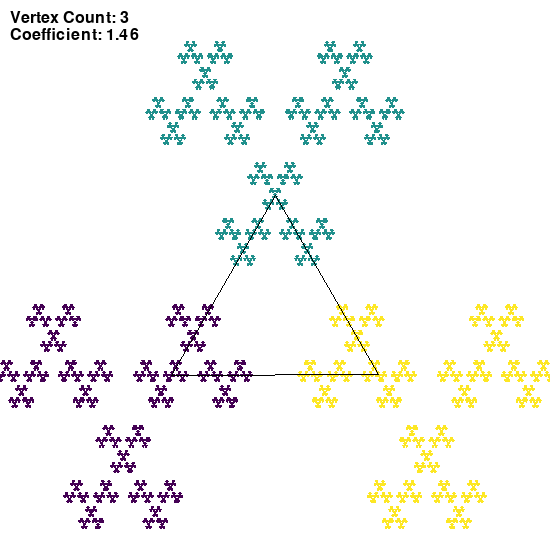
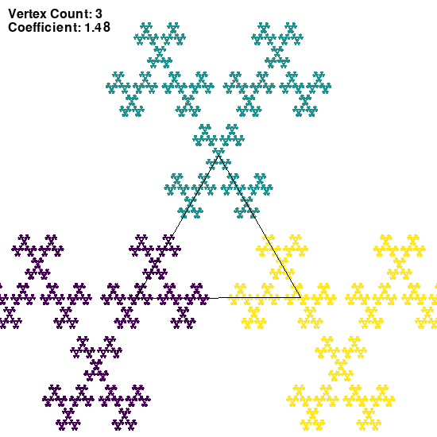
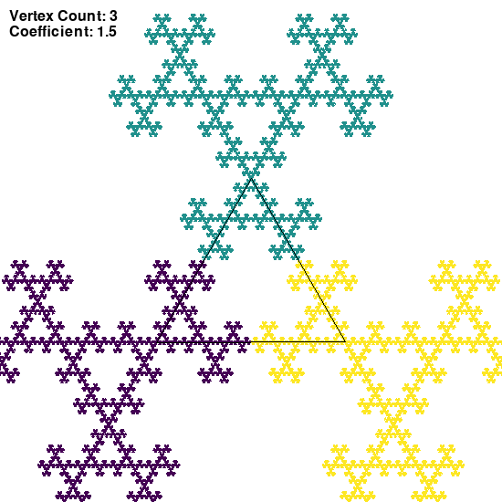
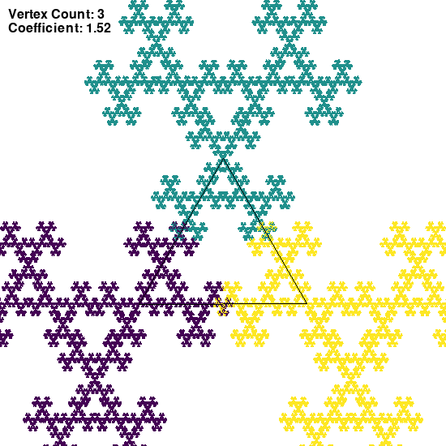
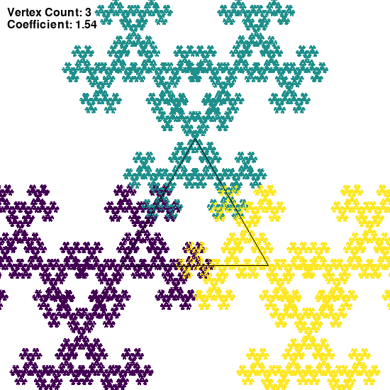

## Chaos game
### Session parameters

Coefficient of LERP: starting at 1.12 and slowly going up (deleted uninteresting states)
Single point opacity: 255/255

__Rule for choosing the next vertex:__
Any vertex ```(randint(1, vertexCount))```
### Images generated



















